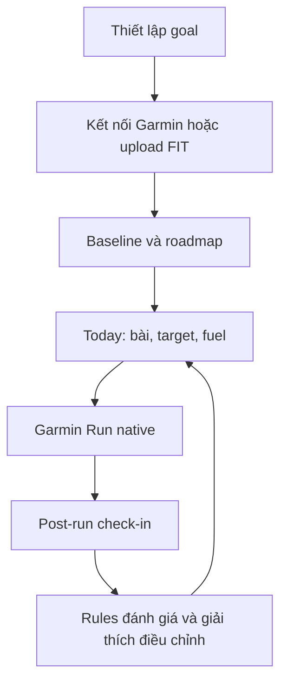

# Luồng cốt lõi

## 1. Vòng lặp sản phẩm

Nutrition, route và injury xuất hiện theo ngữ cảnh; không biến thành form bắt buộc hàng ngày.

## 2. Onboarding → plan đầu tiên

1. Goal: completion/time và ngày race.
2. Availability: ngày chạy, rest cố định, long-run day, thời lượng tối đa, strength.
3. Safety screen ngắn: đau hiện tại, có đổi dáng chạy/đang điều trị hay không.
4. Consent Garmin hoặc FIT upload.
5. Baseline 4–8 tuần: frequency, mileage, long run, easy pace/HR, thành tích, recovery signals nếu có.
6. Tóm tắt plan: duration, buổi/tuần, initial/peak long run, taper, suitability; người dùng xác nhận.

## 3. Hôm nay → chạy → check-in

**Today:** readiness, workout, pace/zone/RPE, weather fallback, fuel và explanation ngắn. User có thể xem detail, chọn route, gửi Garmin, dời/bỏ buổi.

**Garmin:** mở Run native, chọn workout/coursed đã sync, xem AI Coach Data Field. Data Field alert gel/pace theo rule offline; không tự pause hoặc đổi toàn plan.

**Sau run:** mobile hỏi cảm giác, pain (conditional), gel/nước/GI (conditional). Kết quả hiển thị completion, pace/zone compliance, fuel gap và action tiếp theo.

## 4. Missed workout hoặc đổi lịch

1. User chọn thời gian còn lại, dời hoặc bỏ.
2. Training engine tạo lựa chọn an toàn, kiểm tra rest và proximity của quality/long run.
3. Coach giải thích: không chạy nhanh hơn để bù; không dồn bài nặng.
4. User bấm áp dụng; hệ thống log version/reason/impact.

## 5. Pain escalation

1. User chọn pain/triệu chứng trong mobile body map.
2. Safety Engine phân loại theo điểm đau, xu hướng, sưng, dáng chạy và red flags.
3. Nếu low risk: monitor/reduce intensity; nếu elevated: bỏ quality/cross-train/re-check; nếu high/red flag: dừng/không chạy và hướng dẫn tìm hỗ trợ chuyên môn phù hợp.
4. Không chẩn đoán. Cho phép user ghi có chỉ dẫn clinician để AI không ghi đè.

## 6. Long run & fueling

1. Card trước run: meal timing, target carb/h, gel đã thử, water/electrolyte, weather.
2. Garmin nhắc theo timeline offline; mobile hậu kiểm intake thật và GI.
3. Nutrition Engine dùng trend đã xác nhận để đề xuất tinh chỉnh nhỏ ở long run sau, không tuyên bố quan hệ nhân quả từ một buổi.

## 7. Weekly review

Review mặc định ngắn: planned/completed distance/workouts, long run, intensity, pain, fueling và tuần tới. Người dùng có thể mở analytics sâu; bất kỳ tăng/giảm nào đều có reason + expected impact.
