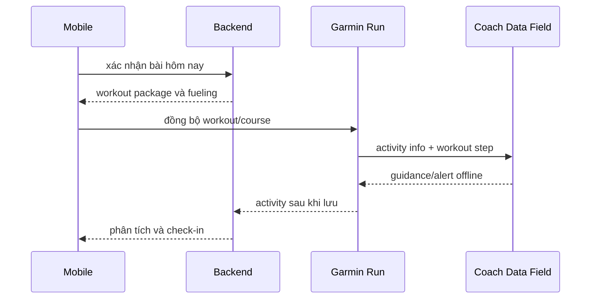

# Garmin & Connect IQ

## 1. Kiến trúc chốt cho MVP

**Garmin Run native + structured workout + Coach Data Field + course native + mobile assistant.** Không có hai app chạy song song trong activity Run.

Glance/widget dùng trước/sau run; Device App độc lập tự ghi activity và **không** chạy song song với Run native. MVP dùng Data Field, không viết replacement running recorder.

## 2. Năng lực Forerunner 165 được nguồn trao đổi xác nhận

| Khả năng | Đánh giá |
| --- | --- |
| Thêm Data Field vào Run/native data screen | xác nhận qua manual FR165 |
| Đọc pace/distance/time/HR và render UI | xác nhận qua Activity/DataField API |
| Đọc current/next workout step, callback step | xác nhận, FR165 được liệt kê |
| Alert/rung | API hỗ trợ; hành vi UX cần PoC |
| Custom FIT fields | FitContributor hỗ trợ |
| Course/native navigation | có, ở mức course/breadcrumb; không full basemap |
| Communications qua điện thoại | có điều kiện: foreground Data Field/API version/kết nối |
| `setWorkout()` | API có; cần kiểm thử lifecycle/firmware thực tế |

Activity fields được nêu gồm `elapsedTime`, `timerTime`, `elapsedDistance`, `currentSpeed`, `averageSpeed`, `currentHeartRate`, `averageHeartRate`, `currentCadence`, `currentLocation`, `altitude`. Pace có thể suy ra từ speed theo `1000 / m/s` (giây/km); alert dùng rolling pace 15–30 giây hoặc lap pace, tolerance và cooldown.

## 3. Điều phải giữ offline

Trước run tải target, workout, gel schedule, rule và route metadata. Trong run Data Field đọc activity info, render và alert; sau run mới sync để AI/recommendation xử lý. Không phụ thuộc request liên tục hay LLM realtime vì Bluetooth/phone/network/foreground state/pin không đáng tin cậy.

## 4. Data Field: làm và không làm

**Làm tốt:** target pace/HR, progress, fuel countdown/alert, trạng thái nhanh-chậm, custom metrics như `pace_compliance` và `fuel_reminders_shown`.

**Không đưa vào:** chat, meal capture, body map, calendar, route selection/map đầy đủ, form dài, inference AI nặng. Xác nhận “đã dùng gel” chỉ là optional tap thử nghiệm trên thiết bị hỗ trợ; flow chuẩn là hỏi trên mobile sau run.

## 5. Garmin platform dependency

Activity/Health/Training/Courses APIs thuộc Garmin Connect Developer Program; quyền chính thức thường cần xét duyệt enterprise. Connect IQ SDK và Garmin Connect APIs là hai chương trình riêng. MVP giảm rủi ro bằng FIT/TCX import, structured workout manual và Data Field PoC trước khi có quyền API.

Nguồn chính thức được cung cấp: [Connect IQ app types](https://developer.garmin.com/connect-iq/connect-iq-basics/app-types/), [Activity API](https://developer.garmin.com/connect-iq/api-docs/Toybox/Activity.html), [DataField API](https://developer.garmin.com/connect-iq/api-docs/Toybox/WatchUi/DataField.html), [Communications](https://developer.garmin.com/connect-iq/api-docs/Toybox/Communications.html), [Training API](https://developer.garmin.com/gc-developer-program/training-api/), [FR165 Connect IQ features](https://www8.garmin.com/manuals-apac/webhelp/forerunner165series/EN-SG/GUID-51D09E19-C2F9-4841-A062-39A9139FA621-7168.html).

Xem [Kế hoạch PoC](./proof-of-concept-plan.md) để chuyển các claim device-specific thành bằng chứng thực nghiệm.
