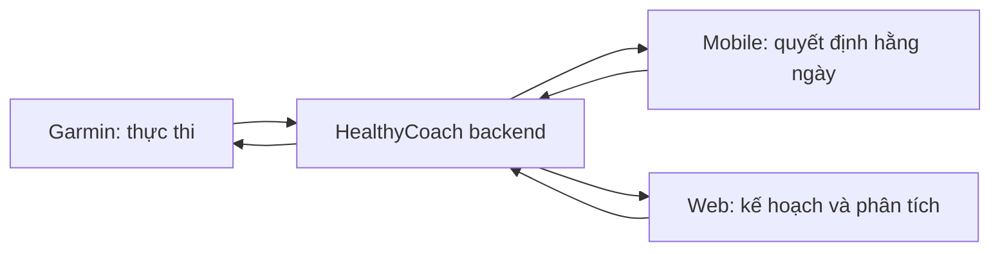

# Phạm vi sản phẩm & giao diện

HealthyCoach có ba interface, mỗi interface làm đúng việc của nó. Không cố đưa chat, food capture hoặc calendar phức tạp lên đồng hồ.

## 1. Phân vai nền tảng

| Nền tảng | Làm | Không làm trong MVP |
| --- | --- | --- |
| Garmin | Run native, structured workout, guidance pace/HR, alert fuel, navigation course | AI chat, body map, camera, form dài, calendar phức tạp |
| Mobile | Today, check-in, food capture, chat, thông báo, đổi lịch | dashboard phân tích dày đặc |
| Web | roadmap, calendar, analytics, route builder, quản lý dữ liệu | tương tác gấp trong lúc chạy |
| Backend | engines, rules, orchestration, audit log, đồng bộ | để LLM tự quyết định safety |

## 2. Information architecture mobile

Navigation P0 chỉ có năm tab: **Hôm nay**, **Kế hoạch**, **Tiến độ**, **Coach**, **Hồ sơ**. Dinh dưỡng, route và pain là contextual entry point trong workout/check-in/Coach, không phải tab chính.

### Today — màn hình quan trọng nhất

Today trả lời năm câu: chạy gì, target nào, readiness có đủ không, fuel gì và kế hoạch đổi ra sao. Card chính hiển thị workout, duration/distance, pace range + zone/RPE, weather adjustment, fueling và một CTA `Xem bài tập`/`Gửi sang Garmin`.

Chỉ hiển thị vài lý do ngắn, ví dụ: recovery tốt, trời nóng nên ưu tiên HR/RPE, hoặc báo đau. Không buộc người dùng đọc VO₂ max, HRV và acute load đồng thời.

### Onboarding (3–5 phút)

1. Chọn mục tiêu và ngày đua; không hỏi target pace khi mục tiêu chỉ là hoàn thành.
2. Chọn 3–5 ngày chạy, ngày long run, ngày không thể tập và thời lượng long run tối đa.
3. Sàng lọc đau: câu hỏi ngắn; chỉ mở body map nếu có đau.
4. Kết nối Garmin với consent rõ ràng, hoặc upload FIT.
5. Phân tích 4–8 tuần baseline.
6. Xác nhận tóm tắt roadmap; chi tiết là progressive disclosure.

### Workout detail và post-run

Workout detail chia Warm-up → Main set → Cool-down, có mục tiêu, RPE/zone, fuel và CTA route/Garmin/dời buổi. Post-run tối đa ba bước: cảm giác, đau (chỉ hỏi sâu nếu có), fueling (chỉ cho bài dài). Kết quả phải là `dữ liệu → kết luận → hành động`.

## 3. Garmin interface

Người dùng chạy trong **Garmin Run native**, chuyển giữa native workout/metrics/course pages và một full-screen Coach Data Field. Data Field đổi state để hiển thị guidance, pace deviation, workout progress hoặc gel reminder; không phải nhiều app song song.

| State | Nội dung tối thiểu |
| --- | --- |
| Guidance | pace, target range, HR/zone, remaining, gel countdown |
| Pace lệch | rolling/lap pace, target, chỉ dẫn ngắn, alert cooldown |
| Fuel | gel #, carb/gói, nhắc nước |
| Progress | step hiện tại, thời gian/distance còn lại, step tiếp theo |

Trên mobile, gel thực tế được xác nhận sau chạy. Tap xác nhận trên đồng hồ chỉ là enhancement cần PoC, không phải dependency.

## 4. Web interface

Web ưu tiên calendar kéo-thả, roadmap theo phase, planned-vs-completed, long-run progression, trend recovery/pain/fueling và explanation log. Khi đổi lịch tạo xung đột (ví dụ leg day trước long run), UI cảnh báo, gợi ý và cho undo.

Route builder web xem map/elevation/POI rồi gửi course đã chọn; không hứa tự đánh giá an toàn tuyệt đối của một tuyến.

## 5. Nguyên tắc UX

- Một quyết định chính mỗi màn hình.
- Chỉ hỏi input không tự động lấy được từ Garmin.
- Chỉ hỏi gel với buổi dài; chỉ hỏi pain chi tiết khi báo đau.
- Cảnh báo pace dùng rolling/lap pace, tolerance và cooldown; không rung liên tục.
- Mọi đề xuất của Coach cần `Áp dụng` trước khi sửa lịch.
- Food image luôn hiển thị range/confidence và yêu cầu xác nhận khẩu phần.

Xem [Luồng cốt lõi](./core-workflows.md) cho sequence chi tiết và [Garmin & Connect IQ](./garmin-integration-and-connect-iq.md) cho giới hạn kỹ thuật.
