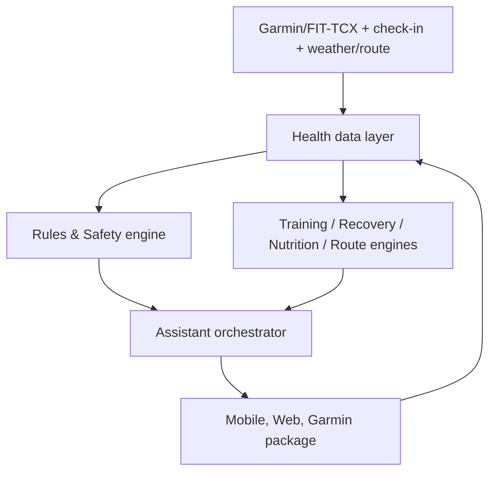

# Kiến trúc hệ thống đề xuất

**Trạng thái:** target architecture; workspace chưa có code xác minh.

## 1. Nguyên tắc kiến trúc

Định lượng và safety thuộc về engine có thể kiểm thử. LLM chỉ thu thập ngữ cảnh, giải thích và hội thoại; không được trực tiếp vượt giới hạn tập hay tự chẩn đoán.

## 2. Thành phần

| Thành phần | Trách nhiệm | Quyết định không được phép |
| --- | --- | --- |
| Ingestion | FIT/TCX trước; Activity/Health API khi được Garmin cấp quyền | Suy diễn dữ liệu thiếu thành fact |
| Athlete/profile | baseline, zones, goal, lịch, giày, preference, consent | Chia sẻ dữ liệu không có quyền |
| Training engine | loại bài, duration, intensity, phase, progression | Bỏ qua safety constraint |
| Recovery engine | readiness signals và subjective state | Xem score là chẩn đoán y tế |
| Nutrition engine | fueling card, carb/gói, sweat-rate logging | Kê đơn hoặc giả vờ khẩu phần ảnh chính xác |
| Safety engine | red flag, load guardrail, escalation | Chẩn đoán/treatment hoặc cho phép high-risk plan |
| Route engine | route candidates theo distance/elevation/POI | Cam kết route tuyệt đối an toàn/chính xác |
| Coach/LLM | hỏi rõ, diễn giải, draft option | tự áp dụng thay đổi chưa xác nhận |
| Garmin adapter | workout/course, local package, FIT custom metrics | yêu cầu network/LLM liên tục khi chạy |

## 3. Data model đề xuất

Đây là danh sách entity định hướng, chưa phải schema đã tồn tại:

`users`, `athlete_profiles`, `race_goals`, `training_plans`, `training_weeks`, `planned_workouts`, `completed_activities`, `activity_laps`, `daily_recovery_metrics`, `subjective_checkins`, `nutrition_profiles`, `fueling_plans`, `fueling_logs`, `injury_flags`, `coach_recommendations`, `plan_adjustments`.

Mọi recommendation/adjustment cần lưu: input snapshot, rule/version, lý do dễ đọc, trạng thái đề xuất/đã áp dụng và actor/time. Dữ liệu nguồn phải giữ provenance (Garmin, FIT upload, người dùng, estimate ảnh).

## 4. Contract chạy offline

Trước buổi chạy, mobile/backend đóng gói structured workout, target pace/HR, fueling reminders, route metadata và local safety rules. Data Field xử lý bằng elapsed time/activity info; sau activity đồng bộ kết quả để phân tích. Không dùng mô hình `mỗi 10 giây gửi HR lên AI rồi chờ phản hồi`.

## 5. Stack tham khảo, không phải quyết định đã triển khai

Nguồn trao đổi đề xuất Next.js + TypeScript (web), NestJS (backend), FastAPI/Python (AI/data), PostgreSQL, Redis/BullMQ, FIT/TCX parser, Docker/Nginx và PWA/React Native về sau. Cần ADR trước khi chọn chính thức; không tài liệu nào chứng minh các dependency này đã có trong repo.

## 6. Ranh giới dữ liệu và riêng tư

- Thu thập tối thiểu, consent theo loại dữ liệu và mục đích.
- Không lưu password Garmin plaintext; OAuth/tokens cần bảo vệ và có revoke.
- Người dùng xem/sửa/xóa health memory, export dữ liệu và rút quyền Garmin.
- Data health/fitness là nhạy cảm: audit truy cập, retention và quyền coach/physio read-only phải được thiết kế trước chia sẻ.

## 7. Quan sát và kiểm thử

Tách unit test cho rules (load, missed workout, red flag, carb math) khỏi prompt/LLM. Có fixture FIT/TCX, audit explanation snapshots, contract test adapter Garmin và device PoC. Mọi capability device-specific phải có matrix thiết bị/firmware, không suy diễn FR165 sang toàn bộ Garmin.
